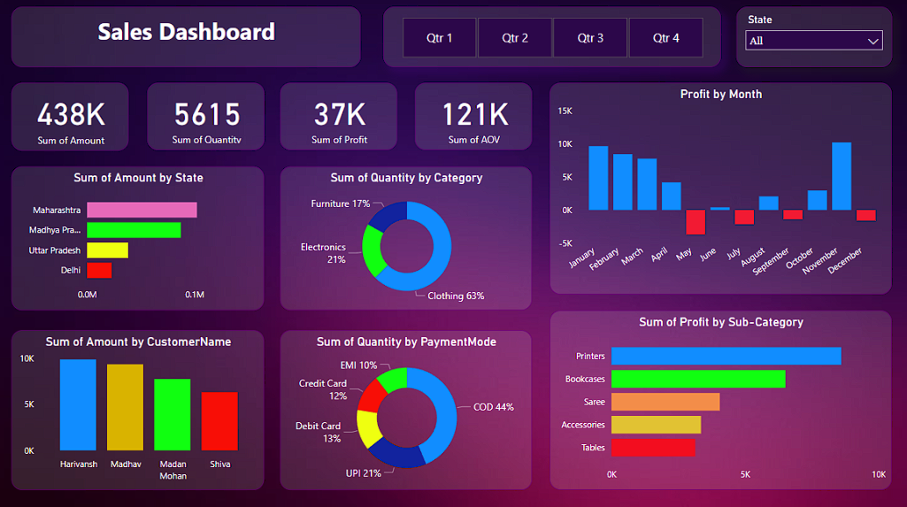

# Sales Dashboard 📊

##  Overview
An interactive Sales Dashboard built to visualize and track online sales performance.  
The dashboard helps in making data-driven decisions using dynamic filtering and detailed drill-down analysis.

## Technologies Used
- Power BI  
- Microsoft Excel  

## Key Features
- Interactive visualization of online sales performance  
- Custom filters and slicers for better data exploration  
- Drill-down capabilities for detailed insights  
- Implemented calculated fields for advanced analysis  
- Data joins to combine multiple datasets  
- Parameters for dynamic and user-friendly interaction  

## Outcome
- Improved decision-making through structured data visualization  
- Enabled users to analyze trends and performance metrics efficiently  

## Dashboard Preview

